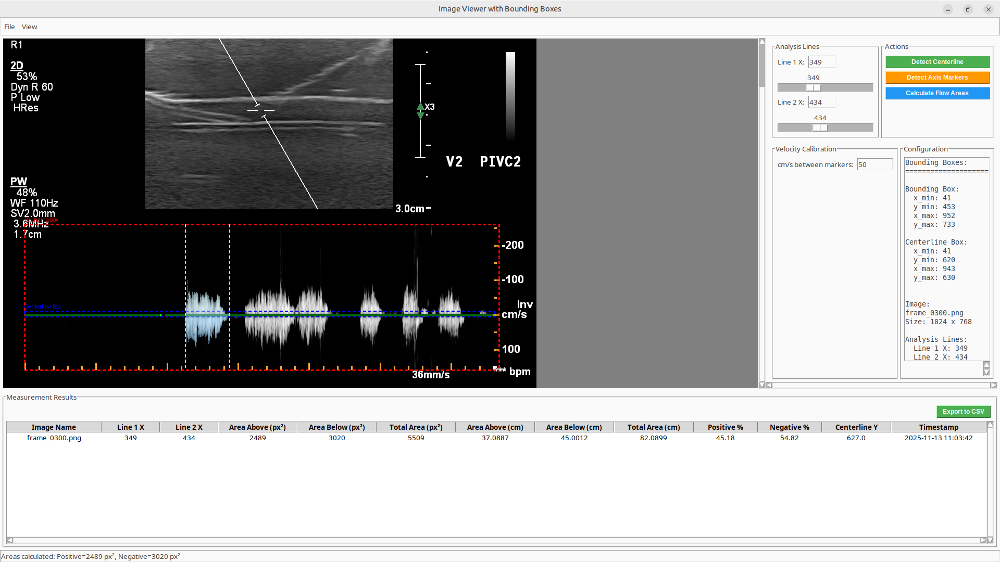

# Ultrasound Study Analysis Tools

A comprehensive toolkit for analyzing ultrasound DICOM images, including DICOM file extraction and interactive image analysis with flow area measurements.



## Overview

This project provides two main tools:

1. **DICOM File Extractor** - Extract images and metadata from DICOM files
2. **Image Viewer with Analysis** - Interactive GUI for analyzing ultrasound images with flow area calculations

## Installation

Install the required dependencies:

```bash
pip install -r requirements.txt
```

Or install manually:

```bash
pip install pydicom numpy Pillow pyyaml scipy opencv-python
```

## Tools

### 1. DICOM File Extractor

A Python script to extract images and metadata from DICOM (Digital Imaging and Communications in Medicine) files.

#### Basic Usage

Extract image and metadata from a DICOM file:

```bash
python dicom_extractor.py input.dcm
```

This will:
- Display common metadata fields
- Extract the image and save it as `input.png` (or first frame for sequences)
- Save all metadata as `input.json`

#### Command-Line Options

```bash
python dicom_extractor.py <dicom_file> [options]
```

**Options:**
- `--image, -i <path>`: Specify output path for extracted image
- `--metadata, -m <path>`: Specify output path for metadata
- `--format, -f <json|txt>`: Metadata output format (default: json)
- `--include-private`: Include private DICOM tags in metadata
- `--no-normalize`: Do not normalize pixel values when saving image
- `--image-format <PNG|JPEG|TIFF>`: Image output format (default: PNG)
- `--common-only`: Display only common metadata fields (don't save full metadata)

**Sequence Options (for multi-frame DICOM files):**
- `--save-sequence`: Save all frames from a sequence to individual files
- `--output-dir <path>`: Output directory for sequence frames (default: `<filename>_frames`)
- `--frame <N>`: Save only a specific frame index from a sequence
- `--start-frame <N>`: First frame to save when saving sequence (default: 0)
- `--end-frame <N>`: Last frame to save when saving sequence (default: last frame)
- `--frame-step <N>`: Step between frames when saving sequence (default: 1, saves all)

#### Examples

Save image to a specific location:
```bash
python dicom_extractor.py input.dcm --image output.png
```

Save all frames from a sequence:
```bash
python dicom_extractor.py input.dcm --save-sequence
```

### 2. Image Viewer with Flow Analysis

An interactive GUI application for analyzing ultrasound images with advanced flow area calculations.

#### Features

- **Bounding Box Overlay**: Visualize and configure bounding boxes from YAML configuration
- **Centerline Detection**: Automatically detect brown centerline in images
- **Axis Marker Detection**: Detect and exclude axis markers from calculations
- **Velocity Marker Detection**: Detect velocity calibration markers
- **Flow Area Calculation**: Calculate positive and negative flow areas above and below centerline
- **Area Highlighting**: Visual highlighting of segmented areas in two shades of light blue
- **Measurement Table**: Track all measurements with automatic timestamping
- **CSV Export**: Export measurement results to CSV for further analysis
- **Automatic Calibration**: 
  - X-axis: Pixels to seconds (from axis markers)
  - Y-axis: Pixels to cm/s (from velocity markers)
  - Area conversion: px² → (seconds × cm/s) = cm

#### Usage

Launch the image viewer:

```bash
python image_viewer.py
```

Or specify a custom config file:

```bash
python image_viewer.py --config path/to/config.yaml
```

#### Workflow

1. **Load Image**: Use `File > Load PNG...` or `Ctrl+O` to load a PNG image
2. **Configure Analysis Lines**: Set Line 1 X and Line 2 X positions to define the analysis region
3. **Detect Centerline**: Click "Detect Centerline" to automatically detect the brown centerline
4. **Detect Axis Markers**: Click "Detect Axis Markers" to detect and exclude axis markers
5. **Set Velocity Calibration**: Enter the cm/s value between velocity markers
6. **Calculate Flow Areas**: Click "Calculate Flow Areas" to:
   - Calculate positive flow area (above centerline)
   - Calculate negative flow area (below centerline)
   - Convert areas from px² to cm using calibration factors
   - Add measurement to results table
   - Highlight segmented areas on the image

#### Configuration

The application uses a YAML configuration file (`config/us_config.yaml`) to define:

- **Bounding Box**: Region of interest coordinates
- **Centerline Box**: Region for centerline detection

Example configuration:

```yaml
bounding_box:
  x_min: 41
  y_min: 453
  x_max: 952
  y_max: 733

centerline_box:
  x_min: 41
  y_min: 620
  x_max: 943
  y_max: 630
```

#### Measurement Results

Each measurement includes:
- Image name
- Analysis line positions (Line 1 X, Line 2 X)
- Area measurements in px² and cm
- Positive and negative percentages
- Centerline Y position
- Timestamp

Results can be exported to CSV using the "Export to CSV" button.

#### Area Conversion

The application automatically converts areas from pixels² to centimeters using:
- **X direction**: Pixels → seconds (calibrated from axis markers)
- **Y direction**: Pixels → cm/s (calibrated from velocity markers)
- **Result**: px² → (seconds × cm/s) = cm

Conversion factor = `(cm_per_second_per_pixel / pixels_per_second)`

## Using as a Python Module

### DICOM Extractor

You can import and use the `DICOMExtractor` class in your own Python scripts:

```python
from dicom_extractor import DICOMExtractor

# Create extractor
extractor = DICOMExtractor('path/to/file.dcm')

# Load the DICOM file
extractor.load()

# Extract image (returns numpy array)
image_array = extractor.extract_image()

# Check if it's a sequence
if extractor.is_sequence():
    num_frames = extractor.get_num_frames()
    print(f"Sequence with {num_frames} frames")
    
    # Get a specific frame
    frame_100 = extractor.get_frame(100)
    
    # Save all frames
    extractor.save_sequence(output_dir='./frames')
else:
    # Single image
    extractor.save_image('output.png')

# Get all metadata
metadata = extractor.get_metadata()
```

### Image Viewer

The image viewer can be imported and customized:

```python
from image_viewer import ImageViewer
import tkinter as tk

root = tk.Tk()
app = ImageViewer(root, config_path="config/us_config.yaml")
root.mainloop()
```

## Features Summary

### DICOM Extractor
- **Image Extraction**: Extracts pixel data from DICOM files and saves as standard image formats (PNG, JPEG, TIFF)
- **Sequence Support**: Automatically detects and handles multi-frame DICOM sequences
- **Frame Extraction**: Extract individual frames or save entire sequences
- **Metadata Extraction**: Extracts all DICOM tags and metadata
- **Common Fields**: Provides easy access to commonly used metadata fields
- **Normalization**: Automatically normalizes pixel values for proper image display
- **Multiple Formats**: Supports JSON and text output for metadata
- **Error Handling**: Robust error handling for invalid or corrupted DICOM files

### Image Viewer
- **Interactive GUI**: User-friendly interface with visual feedback
- **Automatic Detection**: Centerline, axis markers, and velocity markers
- **Visual Highlighting**: Color-coded areas above and below centerline
- **Measurement Tracking**: Automatic logging of all measurements
- **Data Export**: CSV export for further analysis
- **Calibration**: Automatic spatial and temporal calibration from image markers

## Requirements

- Python 3.7+
- pydicom >= 2.4.0
- numpy >= 1.21.0
- Pillow >= 9.0.0
- PyYAML >= 5.4.0
- scipy >= 1.7.0 (optional, for advanced marker detection)
- opencv-python >= 4.5.0 (optional, for improved marker detection)

## Project Structure

```
ultrasound_study/
├── config/
│   └── us_config.yaml          # Configuration file for image viewer
├── images/
│   └── screenshot.png          # Screenshot of the image viewer
├── dicom_extractor.py          # DICOM file extraction tool
├── image_viewer.py             # Interactive image analysis GUI
├── requirements.txt            # Python dependencies
└── README.md                   # This file
```

## License

MIT
